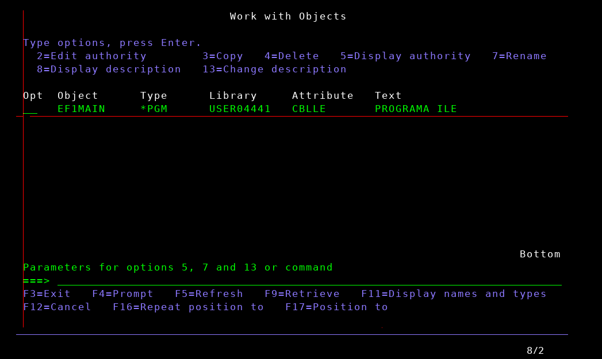

## A little bit encyclopedic intro

IBM's iSeries operating system (formely AS/400) is a legacy computer system which is mainly used in Financial Services industry (Banking, Insurance). It supports application development in many programming languages, yet the most famous are COBOL, RPG, CL.

In Feb 1993, IBM first introduced ILE (Integrated Language Environment) for ILE C and in May 1994 COBOL, RPG, CL join the party. ILE is anenvironment in which code from many languages can be compiled, bound together, and run.

So we can see PGMs with attributes CBL (for COBOL/400) and also with CBLLE (for ILE COBOL).

COBOL/400 is the standard COBOL adopted by IBM for the AS/400 system. It differentiates in the sense that the file handling for reports and subfiles, indicator usage and any other feature specific to AS/400 have been incorporated in it.

## The problem

You, as a developer, often have to find the source code from which a pgm object was compiled. Someone tells you: "Try the DSPOBJD (Display Object Description) command". Let's do it! Go to command line, write `DSPOBJD`, press **F4** button, fill in the required fields and press **ENTER**.

Select option **8** and notice the displayed information.

Voilà! The source code is in Library **USER04441**, in Source file **MYFILE**, in member **EMPCBL**. Our problem is solved! Now let's find **EF1MAIN**'s source code. Following the same process:

Wait! What's going on? Where is our information? We have to remember that **EF1MAIN** is a CBLLE program. When it was compiled it didn't produced directly the executable object, but an intermediate **MODULE** and from this the **PGM** was created.

## The Solution

There is another command which is more generic: `DSPPGM` (Display Program). The Display Program Information for a CBLLE program has a lot of screen, so we have to press **ENTER** until we see:

With **5** option we get:

The source code is in Library **USER04441**, in Source file **SUSANA**, in member **EF1MAIN**.

Now, we really solved our problem!
