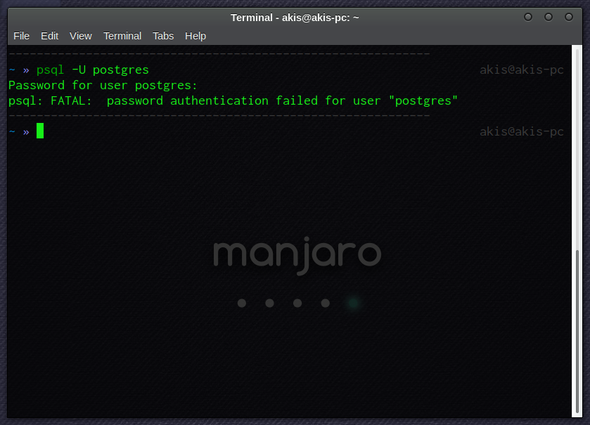
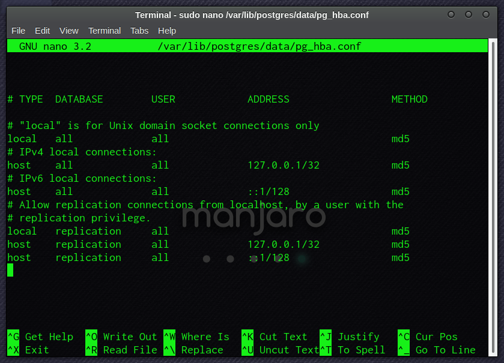
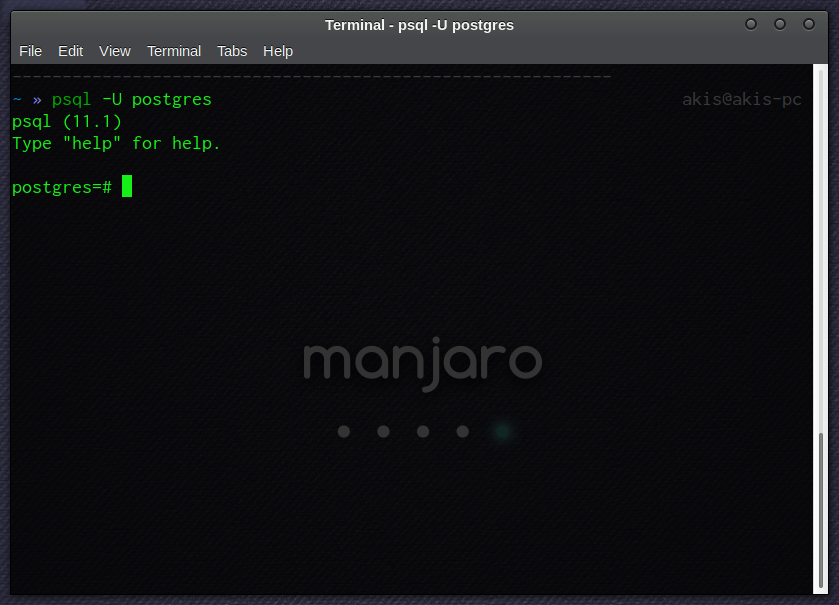
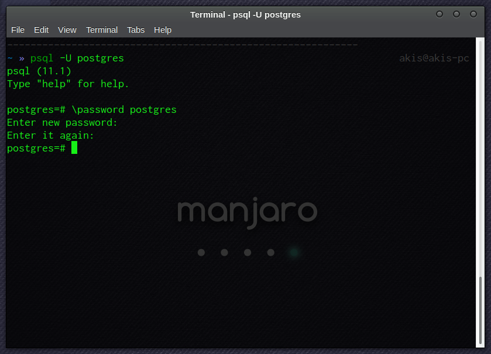
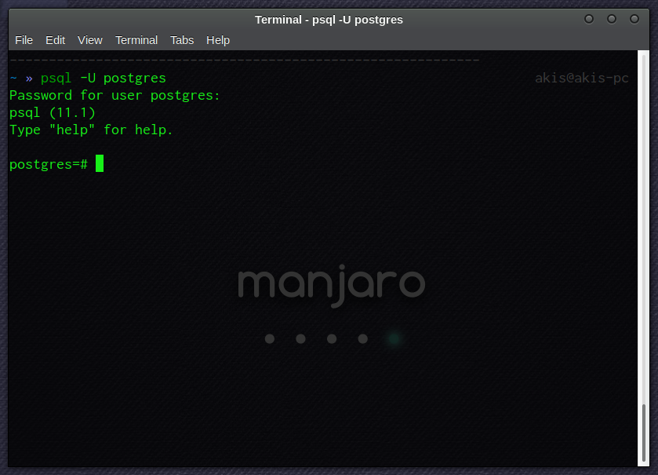

## The moment you realize the problem

It's a good practice even for your local DB server to provide a password for each user. PostgreSQL's default user (who is also an admin) is `postgres`. 

A standard method to get access to our DB is using `psql` command via terminal (I'm running [Manjaro Linux](https://manjaro.org/)). So, we type: 

```bash
psql -U postgres
```
We enter our password and we get the message



## Don't Panic!

First of all, we must find the "PostgreSQL Client Authentication Configuration File", which has the name `pg_hba.conf`. In Manjaro, it lives in path `/var/lib/postgres/data/pg_hba.conf`. Be careful that it is required to have root permissions.

```bash
sudo nano /var/lib/postgres/data/pg_hba.conf
```



We change the `md5` authentication in "local" connection to `trust`

```
local   all             all                                     trust
```

and we restart our server

```bash
sudo systemctl restart postgresql
```

Now PostgreSQL doesn't ask a password and we are allowed to connent with user `postgres`



Next step is to reset the password



We exit `psql`, we turn back `pg_hba.conf` to it's previous state (`md5` authentication) and we restart the server. We are able to connent using our new password for user `postgres`.


